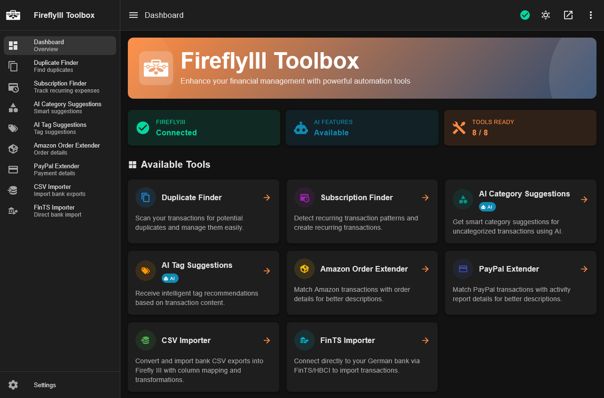

<picture>
  <source media="(prefers-color-scheme: dark)" srcset="public/logo.png">
  <source media="(prefers-color-scheme: light)" srcset="public/logo_light_mode.png">
  
</picture>

# Toolbox for Firefly III

[](LICENSE)
[](https://github.com/xenolphthalein/firefly-toolbox/pkgs/container/firefly-toolbox)
[](https://nodejs.org/)
[](https://vuejs.org/)

Web automation suite for [Firefly III](https://firefly-iii.org). Includes tools for duplicate detection, subscription analysis, AI-powered categorization, bank imports and transaction enrichment via Amazon/PayPal exports.

> [!WARNING]
> **AI-Generated Code Disclosure**
>
> This project was implemented entirely by AI coding tools (Claude, Gemini, ChatGPT). The only exception is the logo, which was manually created because AI still sucks at creating logos. While a professional developer supervised the decision-making process, no credit or responsibility is taken for the code itself. Please exercise caution when using this software with your financial data in any environments you do not fully control or trust.



---

## Table of Contents

- [Toolbox for Firefly III](#toolbox-for-firefly-iii)
  - [Table of Contents](#table-of-contents)
  - [Features](#features)
    - [Duplicate Finder](#duplicate-finder)
    - [Subscription Finder](#subscription-finder)
    - [AI Category Suggestions](#ai-category-suggestions)
    - [AI Tag Suggestions](#ai-tag-suggestions)
    - [Amazon Order Extender](#amazon-order-extender)
    - [PayPal Extender](#paypal-extender)
    - [CSV Importer](#csv-importer)
    - [FinTS Importer](#fints-importer)
  - [Installation](#installation)
    - [Docker (Recommended)](#docker-recommended)
    - [Manual Installation](#manual-installation)
  - [Configuration](#configuration)
    - [Core Settings](#core-settings)
    - [Authentication](#authentication)
    - [AI Providers](#ai-providers)
    - [Additional Options](#additional-options)
  - [Deployment](#deployment)
    - [Reverse Proxy Setup](#reverse-proxy-setup)
    - [Security Recommendations](#security-recommendations)
  - [Troubleshooting](#troubleshooting)
  - [Contributing](#contributing)
  - [License](#license)

---

## Features

### Duplicate Finder

Identifies potential duplicates by comparing amounts, dates, and descriptions. Grouping is based on a multi-factor confidence score. Review matches and link them directly in Firefly III.

### Subscription Finder

Detects recurring payment patterns (weekly, monthly, quarterly, annual) based on amounts, merchants, and timing. Convert detected patterns into Firefly III recurring transactions.

### AI Category Suggestions

Suggests categories for uncategorized transactions using OpenAI or Ollama. Matching is done against existing Firefly III categories with confidence scoring and bulk application.

### AI Tag Suggestions

Recommends tags for transactions based on description analysis and your existing tag library.

### Amazon Order Extender

Enriches transactions with Amazon order details (item names, IDs). Requires JSON export from the [Order History Exporter for Amazon](https://github.com/xenolphthalein/order-history-exporter-for-amazon) extension. Matches by amount and date.

### PayPal Extender

Adds merchant names, emails, and transaction IDs to Firefly III transactions using PayPal CSV activity exports.

### CSV Importer

Generic CSV import tool with visual column mapping, data transformation rules, and preview. Configurations can be saved for reuse.

### FinTS Importer

Direct import for German banks via FinTS/HBCI. Supports TAN procedures (mobile/push). Requires [FinTS product registration](https://www.fints.org/de/hersteller/produktregistrierung).

---

## Installation

### Docker (Recommended)

Use the provided [compose.yaml](compose.yaml):

```bash
docker compose up -d
```

Binds to `127.0.0.1:3000`. Use a reverse proxy for TLS/Auth.

### Manual Installation

Requires Node.js 20+.

```bash
# Clone the repository
git clone https://github.com/xenolphthalein/firefly-toolbox.git
cd firefly-toolbox

# Install dependencies
npm install

# Copy and edit the environment file
cp .env.example .env

# Build and start
npm run build
npm start
```

For development with hot reload:

```bash
npm run dev
```

> **Note:** Manual execution binds to `0.0.0.0` (all interfaces). Ensure port 3000 is firewalled or proxied. Docker binds to localhost by default.

---

## Configuration

Configuration is handled through environment variables. Copy `.env.example` to `.env` and adjust the values for your setup.

### Core Settings

| Variable | Description | Default |
|----------|-------------|---------|
| `FIREFLY_API_URL` | URL of your Firefly III instance | Required |
| `FIREFLY_API_TOKEN` | Firefly III Personal Access Token | Required |
| `PORT` | Server port | `3000` |
| `APP_URL` | Public URL (for OAuth callbacks) | `http://localhost:3000` |
| `NODE_ENV` | `development` or `production` | `development` |
| `CORS_ORIGINS` | Allowed CORS origins (comma-separated) | Localhost URLs |

Create a Personal Access Token in Firefly III under Profile, OAuth, Personal Access Tokens. See the [Firefly III documentation](https://docs.firefly-iii.org/how-to/firefly-iii/features/api/#personal-access-tokens) for details.

### Authentication

The toolbox supports multiple authentication methods. In production, authentication is required unless explicitly disabled.

| Variable | Description |
|----------|-------------|
| `AUTH_METHODS` | Comma-separated list: `basic`, `oidc`, `firefly`, `none` (e.g., `basic,firefly`) |
| `AUTH_SESSION_SECRET` | Session secret (required in production) |

If `AUTH_METHODS` is not set, all configured methods are auto-detected. Set it explicitly to restrict which methods are shown on the login page.

**Basic Authentication**

| Variable | Description |
|----------|-------------|
| `AUTH_BASIC_USERNAME` | Username |
| `AUTH_BASIC_PASSWORD` | Password |

**OIDC (Authentik, Keycloak, etc.)**

| Variable | Description |
|----------|-------------|
| `AUTH_OIDC_ISSUER_URL` | Issuer URL |
| `AUTH_OIDC_CLIENT_ID` | Client ID |
| `AUTH_OIDC_CLIENT_SECRET` | Client secret |
| `AUTH_OIDC_SCOPES` | Scopes (default: `openid profile email`) |

**Firefly III OAuth**

| Variable | Description |
|----------|-------------|
| `AUTH_FIREFLY_CLIENT_ID` | OAuth client ID |
| `AUTH_FIREFLY_CLIENT_SECRET` | OAuth client secret |

### AI Providers

AI features (category and tag suggestions) require either OpenAI or a local Ollama instance.

| Variable | Description | Default |
|----------|-------------|---------|
| `AI_PROVIDER` | `openai` or `ollama` | Auto-detect |
| `AI_MODEL` | Override model for any provider | - |

**OpenAI**

| Variable | Description | Default |
|----------|-------------|---------|
| `OPENAI_API_KEY` | API key | - |
| `OPENAI_API_URL` | API URL (for compatible services) | `https://api.openai.com/v1` |
| `OPENAI_MODEL` | Model name | `gpt-4o-mini` |

**Ollama**

| Variable | Description | Default |
|----------|-------------|---------|
| `OLLAMA_API_URL` | Ollama API URL | `http://localhost:11434` |
| `OLLAMA_MODEL` | Model name | `llama3.2` |

### Additional Options

| Variable | Description | Default |
|----------|-------------|---------|
| `DEFAULT_LOCALE` | Default language: `en` or `de` | Auto-detect from browser |
| `FINTS_PRODUCT_ID` | FinTS registration ID for German bank imports | - |
| `LOG_LEVEL` | `error`, `warn`, `info`, or `debug` | `info` |
| `NUMBER_FORMAT_LOCALE` | Locale for parsing numbers | `en-US` |
| `NUMBER_FORMAT_DECIMAL` | Decimal separator | `.` |
| `NUMBER_FORMAT_THOUSANDS` | Thousands separator | `,` |

---

## Deployment

### Reverse Proxy Setup

When running behind a reverse proxy (nginx, Caddy, Traefik), configure the following:

1. **Enable TLS** on the proxy. Financial data should never travel over plain HTTP.

2. **Set `APP_URL`** to the external URL (e.g., `https://toolbox.example.com`).

3. **Set `CORS_ORIGINS`** to match the external URL exactly.

4. **Forward headers** for proper protocol detection:

   ```nginx
   # nginx
   location / {
       proxy_pass http://127.0.0.1:3000;
       proxy_http_version 1.1;
       proxy_set_header Host $host;
       proxy_set_header X-Real-IP $remote_addr;
       proxy_set_header X-Forwarded-For $proxy_add_x_forwarded_for;
       proxy_set_header X-Forwarded-Proto $scheme;
       
       # Required for SSE streaming
       proxy_buffering off;
       proxy_cache off;
       proxy_read_timeout 86400s;
   }
   ```

5. **Disable buffering** for Server-Sent Events. The toolbox uses SSE for real-time progress updates during long-running operations. Ensure your proxy does not buffer responses for `/api/*` routes.

### Security Recommendations

The toolbox proxies all requests to Firefly III using your API token. A compromised instance means full access to your financial data.

**Single-Tenant Architecture**

This application is designed for single-tenant use. All users share the same Firefly III API token, meaning everyone who can log in has identical access to all transactions, categories, and tags. This is intentional for households sharing a single budget. If you need per-user access control, deploy separate instances with separate API tokens.

**Production Checklist**

| Requirement | How |
|-------------|-----|
| Authentication | Set `AUTH_METHODS` to `basic`, `oidc`, `firefly`, or a combination |
| Session secret | Set `AUTH_SESSION_SECRET` to a random 32+ character string |
| CORS origins | Set `CORS_ORIGINS` to your exact frontend URL |
| Network binding | Use the default localhost binding in Docker |
| TLS | Terminate at your reverse proxy |
| Secrets | Store `.env` with restricted permissions (`chmod 600`) |

---

## Troubleshooting

**504 Gateway Timeout**

Long-running operations may exceed your proxy's default timeout. Increase the read timeout:

```nginx
proxy_read_timeout 300s;
```

For very large datasets (10,000+ transactions), process in smaller date ranges.

**CORS Errors**

Ensure `CORS_ORIGINS` matches your URL exactly without trailing slashes. Set `APP_URL` when running behind a proxy.

**CSRF Token Errors**

Add `X-Forwarded-Proto` header in your proxy configuration and ensure `APP_URL` matches the actual access URL.

**401 Unauthorized from Firefly III**

Verify your API token is valid and not expired. Generate a new Personal Access Token in Firefly III if needed.

**Connection Refused**

If both services run in Docker, use container names instead of `localhost`:

```yaml
FIREFLY_API_URL=http://firefly:8080
```

For self-signed certificates, set `NODE_EXTRA_CA_CERTS` to your CA certificate path.

---

## Contributing

Contributions are welcome. Please submit PRs to the `main` branch.

**Development Commands**

```bash
npm run dev          # Start development server
npm run build        # Production build
npm run typecheck    # TypeScript validation
npm run lint         # ESLint
npm run format       # Prettier
```

## License

This project is released under the [Unlicense](LICENSE), dedicating it to the public domain. You are free to use, modify, and distribute it for any purpose without restrictions.
